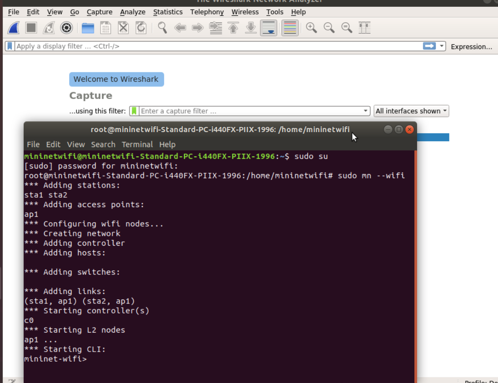

# Mininet-WiFi Beginer
- We will walk you through how to use mininet-wifi from a beginer to the advance labs. We provide the examples for many use cases. This tutorial is beased on [mininet-wifi](https://www.brianlinkletter.com/2016/04/mininet-wifi-software-defined-network-emulator-supports-wifi-networks/).

## Tutorial #1: 
One access point shows how to run the simplest Mininet-WiFi scenario, shows how to capture wireless traffic in a Mininet-Wifi network, and discusses the issues with OpenFlow and wireless LANs. 
- The simplest network is the default topology, which consists of a wireless access point with two wireless stations. The access point is a switch connected to a controller. The stations are hosts.
- This simple lab will allow us to demonstrate how to capture wireless control traffic and will demonstrate the way an OpenFlow-enabled access point handles WiFi traffic on the wlan interface.

### Capturing Wireless control traffic in Mininet-WiFi
 To view wireless control traffic we must first start Wireshark:

`wifi:~$ sudo wireshark &`  

