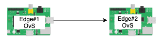
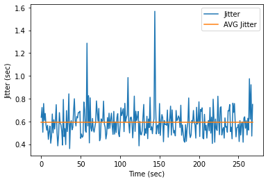
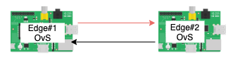
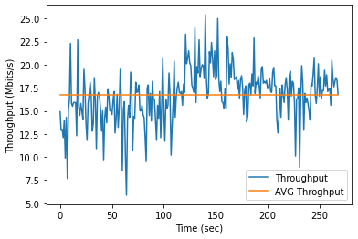
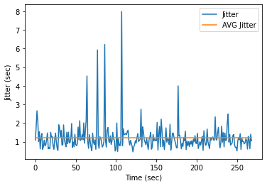
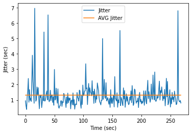

## Experiment 1: Maximum throughput 
This experiment aims to find the maximum throughput of a link between a pair of edge nodes under different scenarios as follows. 

### Experiment 1.1 : Maximum throughput between 2 edge nodes (one directional communication).
This experiment aims to find the maximum throughput of a link between Edge#1 and Edge#2.   

#### Results 1.1 : 
The maximum throughput of a link between Edge#1 and Edge#2 as shown in Fig.1. The average throughput is equal to 32.5357 Mbits/sec and its variance is equal to 1.6304. 

The jitter of link communication between Edge#1 and Edge#2 as shown in Fig.2. The average jitter is equal to 0.5936 sec and its variance is equal to 0.0175.  

### Experiment 1.2 : Maximum throughput between 2 edge nodes (bidirectional communication).
This experiment aims to find the maximum throughput of a link between Edge#1 and Edge#2, where Edge#1 and Edge#2 simultaneously forward packets to each other.   

#### Results 1.2.1 : 
The maximum throughput of a link between Edge#1 and Edge#2 as shown in Fig.1. The average throughput is equal to 16.7302 Mbits/sec and its variance is equal to 8.409. 

The jitter of link communication between Edge#1 and Edge#2 as shown in Fig.2. The average jitter is equal to 1.2076 sec and its variance is equal to 0.594.  

#### Results 1.2.2 : 
The maximum throughput of a link between Edge#1 and Edge#2 as shown in Fig.1. The average throughput is equal to 16.0997 Mbits/sec and its variance is equal to 9.5179. 

The jitter of link communication between Edge#1 and Edge#2 as shown in Fig.2. The average jitter is equal to 1.310 sec and its variance is equal to 0.7859.  
