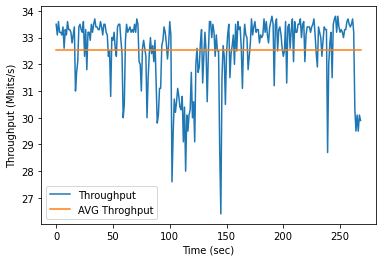

## Experiment 1: Maximum throughput 
This experiment aims to find the maximum throughput of a link between each edge node pair. 
For example, the throughput of a link between Edge#1 and Edge#2.   

### Results 1: 
The maximum throughput of a link between Edge#1 and Edge#2 as shown in Fig.1. The average throughput is equal to 32.5357 Mbits/sec and its variance is equal to 1.6304. 

The jitter of throughput iof a link between Edge#1 and Edge#2 as shown in Fig.2. The average jitter is equal to 0.5936 sec and its variance is equal to 0.0175.  

### Results 2: 
The maximum throughput of a link between Edge#1 and Edge#2 as shown in Fig.1. The average throughput is equal to 16.7302 Mbits/sec and its variance is equal to 8.409. 

The jitter of throughput iof a link between Edge#1 and Edge#2 as shown in Fig.2. The average jitter is equal to 1.2076 sec and its variance is equal to 0.594.  

