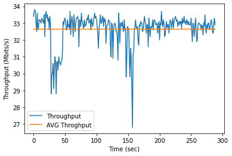
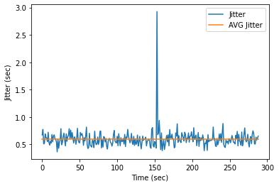

# Experiment 5: The effect of the distance between 2 edge nodes to the maximum throughput 

This experiment aims to find the maximum throughput of a link between a pair of edge nodes under different scenarios as follows. 

### Experiment 5.1 : Maximum throughput between 2 edge nodes (one directional communication).
This experiment aims to find the maximum throughput of a link between Edge#1 and Edge#2, where the distance between 2 ede nodes is equal to 5 cm.   

The average of the throughput is equal to 32.6384 Mbits/s.

The jitter of link communication between Edge#1 and Edge#2 as shown in Fig.2. The average jitter is equal to 0.5936 sec and its variance is equal to 0.5936.  

