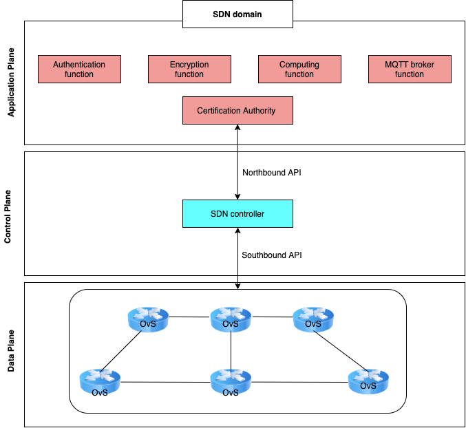
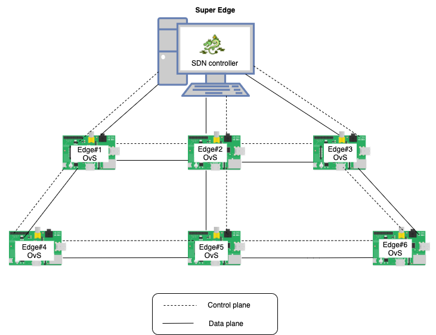

# SADEdge: SDN Assisted Distributed Edge Computing for Privacy Preservation in IoT

* [General Information](#general-information)
* [Technologies Used](#technologies-used)
* [Features](#features)
* [Setup](#setup)
* [Usage](#usage)
* [Project Status](#project-status)
* [Room for Improvement](#room-for-improvement)
* [Acknowledgements](#acknowledgements)
* [Project contributors](#Project-contributors)
* [Contact](#contact)
* [License](#license) 

## General Information
**SADEdge** is a part of the "Privacy-Preserving as a Service for IoT" project founded by [BTFP of NBTC](https://btfp.nbtc.go.th/) Thailand. SADEdge mainly focuses on developing the network management techniques and network functions deployed in a distributed edge computing (DEC) network. SADEdge aims to improve the network reliability and efficiency of distributed edge computing (DEC) in IoT. 

### Why SDN?

A distributed edge computing (DEC) network is proposed to overcome the challenges in wireless-mesh IoT in wide area for Industrial IoT. However, DEC itself has no QoS and reliability guarantee due to an inherit distributed manner of wireless mesh ad-hoc network. 
To improve DEC's reliability and QoS, SDN has been seen a promising tool because the SDN framework can simplify the network management and can make the distributed edge computing controlable.  

SADEdge consists of 3 main elements:  
* SDN controller : We use [Ryu controller](https://github.com/faucetsdn/ryu) as a SDN controller to manage the IoT packet flows.  
* Virtual switch : We use [OvS](https://www.openvswitch.org/) as a virtual switch located in an edge computing node.  
* Wireless mesh ad-hoc network : We form a distributed edge computing (DEC) network with a wireless mesh ad-hoc network where edge nodes rely the MQTT messages from IoT devices (i.e., Edge computing nodes) to the IoT gateway (i.e., Super Edge node) and sends those MQTT messages to the IoT cloud.  

SDNEdge Architecture:  

 

SADEdge network topology:  
* Here we present an example of SADEdge network topology.  

 

## Technologies Used
- [Ryu Controller](https://ryu-sdn.org/) 
- [OvS](https://www.openvswitch.org/download/)
- [MQTT broker](https://www.hivemq.com/blog/mqtt-toolbox-mqttbox/)
- Raspberry Pi 3 model B+ with Raspbian OS
- Wireless antenna, i.e., one which is compatible with Raspberry Pi 3 model B+ is [TP-Link](https://www.tp-link.com/th/home-networking/adapter/archer-t2u-plus/) and its driver can be downloaded from [rtl8812au](https://github.com/aircrack-ng/rtl8812au) which supports the USB id your wifi adapters use.  For the Raspbian OS and they are available to download from [wifi-driver](http://downloads.fars-robotics.net/wifi-drivers/).

## Features (Under testing)
List the ready features here:
- Wireless ad-hoc mode
- [Maximum Throughput](https://github.com/TNatapon/Privacy_SDN_Edge_IoT/tree/main/PlanB) 
- [Static routing](https://github.com/TNatapon/Privacy_SDN_Edge_IoT/tree/main/flowrules)
- Dynamic routing

## Setup & Requirements
* DEC network: 
    * Edge node: we use Raspberry Pi 3 model B+ and install Raspbian OS (version xxx).
    * Superedge : we use a PC or laptop and install Ubuntu 20.04.
    * Antenna : Install driver [rtl8812au](https://github.com/aircrack-ng/rtl8812au).
* Code : 
    * Python 3.8 
    * Shell script 

## Usage

### How to test the link bandwidth of a DEC network
How do we test the maximum throughput of a link between a edge node pairs:

`iperf3 -u -c 10.0.0.1 -b0 -n 20M -bidir`

How to test a static routing algorithm
1) Make all Raspberry Pis in the ad-hoc mode  
2) Run `run.sh files` in all Raspberry Pis  
3) After running `sh files` , a Raspberry Pi cannot ping each other anymore  
4) Run [superedge.py](https://github.com/TNatapon/Privacy_SDN_Edge_IoT/blob/main/flowrules/superedge.py) file in superedge by using   
`ryu-manager superedge.py` 
6) Rum ping command again in each Raspberry Pi  

## Project Status
SADEdge under developing...

## Room for Improvement

## Acknowledgements
This project is supported by [BTFP of NBTC](https://btfp.nbtc.go.th/) Thailand. 

## Project contributors
* Kalika Suksomboon  
   * Researcher  
   * CPS (Cyber-Physical Systems) Laboratory, NECTEC, Thailand  

* Aimaschana Niruntasukrat  
   * Researcher  
   * CPS (Cyber-Physical Systems) Laboratory, NECTEC, Thailand  

* Sophon Mongkolluksamee  
   * Professor  
   * Srinakharinwirot University, Bangkok, Thailand  

* Koonlachat Meesublak  
   * Researcher  
   * CPS (Cyber-Physical Systems) Laboratory, NECTEC, Thailand  

* Natapon Tansangworn  
   * Researcher  
   * CPS (Cyber-Physical Systems) Laboratory, NECTEC, Thailand  

* Tawan Hohum  
   * Researche Assistant  
   * CPS (Cyber-Physical Systems) Laboratory, NECTEC, Thailand  

* Phoo Phoo Thet Lyar Tun  
   * Researche Assistant  
   * CPS (Cyber-Physical Systems) Laboratory, NECTEC, Thailand  

## Contact
We are committed to open-sourcing our work to support IIoT use cases. We want to know how yoi use this library and what problems it helps you to solve. We have a communication channel for you to contact us:
* Kalika Suksomboon  
    * The project email: somboonbox.netpie@google.com
  
## License 
MIT. See [LICENSE](https://github.com/google/fully-homomorphic-encryption/blob/main/LICENSE).